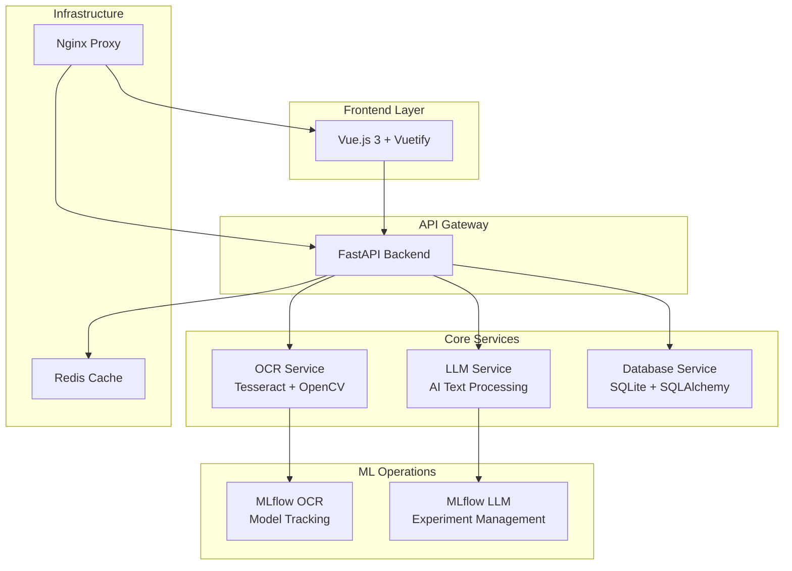

# 🎯 FlashCards AI - Intelligent Learning Platform

[](https://opensource.org/licenses/MIT)
[](https://www.docker.com/)
[](https://vuejs.org/)
[](https://fastapi.tiangolo.com/)

> Transform your documents into interactive flashcards using cutting-edge OCR and AI technology. Learn smarter, not harder.

## 🌟 Overview

FlashCards AI is a modern, full-stack application that revolutionizes the way you create and study flashcards. By leveraging advanced OCR (Optical Character Recognition) and AI technologies, it automatically extracts text from your documents and generates intelligent question-answer pairs for optimal learning.

### ✨ Key Features

- 🤖 **AI-Powered Flashcard Generation** - Automatically create Q&A pairs from your documents
- 📄 **Advanced OCR Processing** - Extract text from images and PDFs with high accuracy
- 🎯 **Interactive Study Mode** - Engaging flashcard interface with progress tracking
- 📊 **MLflow Integration** - Comprehensive model tracking and experimentation
- 🌐 **Public Deck Sharing** - Browse and study community-created flashcard decks
- 📱 **Responsive Design** - Beautiful, modern UI that works on all devices
- 🔐 **Secure Authentication** - User accounts with JWT-based security
- 🐳 **Docker Containerized** - Easy deployment and development setup

## 🏗️ Architecture



### 🔧 Technology Stack

#### Frontend
- **Vue.js 3** - Progressive JavaScript framework
- **Vuetify 3** - Material Design component library
- **Pinia** - State management
- **Vue Router** - Client-side routing
- **Axios** - HTTP client

#### Backend
- **FastAPI** - Modern Python web framework
- **SQLAlchemy** - Database ORM
- **Pydantic** - Data validation
- **JWT** - Authentication
- **Redis** - Caching and session storage

#### AI/ML Services
- **Tesseract OCR** - Text extraction from images
- **OpenCV** - Image processing
- **MLflow** - ML experiment tracking
- **Transformers** - AI text processing

#### Infrastructure
- **Docker** - Containerization
- **Nginx** - Reverse proxy
- **SQLite** - Database (development)
- **Redis** - Caching layer

## 🚀 Quick Start

### Prerequisites

- Docker and Docker Compose
- Git
- 4GB+ RAM recommended

### Installation

1. **Clone the repository**
   ```bash
   git clone https://github.com/simbouch/flashcards-projet.git
   cd flashcards-projet
   ```

2. **Start the application**
   ```bash
   docker-compose up --build
   ```

3. **Access the application**
   - Frontend: http://localhost:8080
   - Backend API: http://localhost:8000
   - MLflow OCR: http://localhost:5000
   - MLflow LLM: http://localhost:5001

### First Steps

1. **Create an account** at http://localhost:8080/register
2. **Upload a document** (PDF or image) in the Documents section
3. **Generate flashcards** from your uploaded document
4. **Start studying** with the interactive study mode

## 📖 User Guide

### Step-by-Step Workflow

#### 1. 📤 Upload Documents
- Navigate to the **Documents** section
- Upload PDF files or images (JPG, PNG)
- Provide a descriptive name for your document
- Wait for OCR processing to complete

#### 2. 🎯 Generate Flashcards
- Go to **My Decks** and click **Create Deck**
- Select a processed document as the source
- Choose whether to make the deck public
- AI will automatically generate question-answer pairs

#### 3. 📚 Study Mode
- Click **Study** on any deck to enter study mode
- **Tap cards** to flip between questions and answers
- Use study controls:
  - **Next**: Move card behind the next one
  - **Review Later**: Send to end of deck (2nd time removes)
  - **Mastered**: Remove from current session
  - **End Session**: Quit and save progress

#### 4. 🌐 Explore Public Decks
- Browse community-created flashcard decks
- Study public decks without creating an account
- Get inspired by other learners' content

## 🛠️ Development

### Project Structure

```
flashcards-ai/
├── frontend_service/          # Vue.js 3 + Vuetify frontend
│   ├── src/
│   │   ├── components/        # Reusable Vue components
│   │   ├── views/            # Page components
│   │   ├── store/            # Pinia state management
│   │   └── assets/           # Static assets and styles
├── backend_service/          # FastAPI backend
│   ├── app/
│   │   ├── api/              # API endpoints
│   │   ├── models/           # Database models
│   │   ├── services/         # Business logic
│   │   └── core/             # Configuration and utilities
├── ocr_service/              # OCR processing service
├── llm_service/              # AI text processing service
├── db_service/               # Database initialization
├── mlflow_ocr/               # MLflow for OCR models
├── mlflow_llm/               # MLflow for LLM models
└── docker-compose.yml        # Container orchestration
```

### Local Development Setup

1. **Clone and setup**
   ```bash
   git clone https://github.com/simbouch/flashcards-projet.git
   cd flashcards-projet
   ```

2. **Environment variables**
   ```bash
   cp .env.example .env
   # Edit .env with your configuration
   ```

3. **Start development environment**
   ```bash
   docker-compose -f docker-compose.dev.yml up --build
   ```

### Running Tests

```bash
# Frontend tests
cd frontend_service
npm run test

# Backend tests
cd backend_service
pytest

# Integration tests
docker-compose -f docker-compose.test.yml up --abort-on-container-exit

# Run tests by category
pytest -m auth
pytest -m decks
pytest -m flashcards
pytest -m study
pytest -m unit
pytest -m integration
```

## 📊 API Documentation

### Authentication Endpoints

| Method | Endpoint | Description |
|--------|----------|-------------|
| POST | `/auth/register` | Create new user account |
| POST | `/auth/login` | Authenticate user |
| POST | `/auth/logout` | Invalidate user session |

### Document Management

| Method | Endpoint | Description |
|--------|----------|-------------|
| GET | `/documents/` | List user documents |
| POST | `/documents/upload` | Upload new document |
| GET | `/documents/{id}` | Get document details |
| DELETE | `/documents/{id}` | Delete document |

### Flashcard Operations

| Method | Endpoint | Description |
|--------|----------|-------------|
| GET | `/decks/` | List user decks |
| POST | `/decks/` | Create new deck |
| GET | `/decks/{id}` | Get deck with flashcards |
| PUT | `/decks/{id}` | Update deck |
| DELETE | `/decks/{id}` | Delete deck |
| GET | `/decks/public` | List public decks |

### Study Session Management

| Method | Endpoint | Description |
|--------|----------|-------------|
| POST | `/study/sessions` | Start study session |
| POST | `/study/sessions/{id}/records` | Record study response |
| PUT | `/study/sessions/{id}/end` | End study session |
| GET | `/study/history` | Get study history |

For complete API documentation, visit http://localhost:8000/docs when running the application.

## 🚨 Troubleshooting

### Common Issues

#### Application won't start
```bash
# Check Docker status
docker --version
docker-compose --version

# Rebuild containers
docker-compose down
docker-compose up --build --force-recreate
```

#### OCR processing fails
```bash
# Check OCR service logs
docker-compose logs ocr-service

# Verify Tesseract installation
docker-compose exec ocr-service tesseract --version
```

#### Database connection errors
```bash
# Reset database
docker-compose down -v
docker-compose up --build

# Check database logs
docker-compose logs db-service
```

### Performance Optimization

- **Memory**: Increase Docker memory limit to 4GB+
- **Storage**: Ensure sufficient disk space for document uploads
- **Network**: Use local Redis for better caching performance

## 🤝 Contributing

We welcome contributions! Please see our [Contributing Guide](CONTRIBUTING.md) for details.

### Development Workflow

1. Fork the repository
2. Create a feature branch (`git checkout -b feature/amazing-feature`)
3. Commit your changes (`git commit -m 'Add amazing feature'`)
4. Push to the branch (`git push origin feature/amazing-feature`)
5. Open a Pull Request

## 📄 License

This project is licensed under the MIT License - see the [LICENSE](LICENSE) file for details.

## 🙏 Acknowledgments

- [Tesseract OCR](https://github.com/tesseract-ocr/tesseract) for text extraction
- [Vue.js](https://vuejs.org/) and [Vuetify](https://vuetifyjs.com/) for the beautiful frontend
- [FastAPI](https://fastapi.tiangolo.com/) for the robust backend framework
- [MLflow](https://mlflow.org/) for ML experiment tracking

---

<div align="center">
  <p>Made with ❤️ by the FlashCards AI Team</p>
  <p>
    <a href="https://github.com/simbouch/flashcards-projet">⭐ Star us on GitHub</a> •
    <a href="https://github.com/simbouch/flashcards-projet/issues">🐛 Report Bug</a> •
    <a href="https://github.com/simbouch/flashcards-projet/issues">💡 Request Feature</a>
  </p>
</div>
