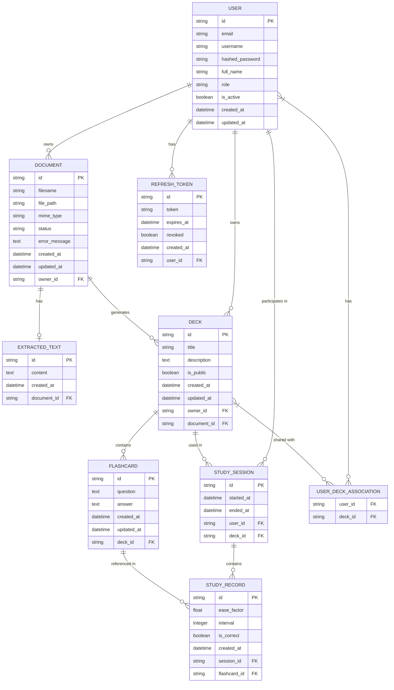

# Conceptual Data Model (CDM)

## Entities and Relationships

### Entities

1. **USER**
   - Represents a system user
   - Attributes: id, email, username, hashed_password, full_name, role, is_active, created_at, updated_at

2. **DOCUMENT**
   - Represents an uploaded document
   - Attributes: id, filename, file_path, mime_type, status, error_message, created_at, updated_at, owner_id

3. **EXTRACTED_TEXT**
   - Contains text extracted from a document via OCR
   - Attributes: id, content, created_at, document_id

4. **DECK**
   - Represents a set of flashcards
   - Attributes: id, title, description, is_public, created_at, updated_at, owner_id, document_id

5. **FLASHCARD**
   - Represents a question/answer card
   - Attributes: id, question, answer, created_at, updated_at, deck_id

6. **STUDY_SESSION**
   - Represents a user's study session with a deck
   - Attributes: id, started_at, ended_at, user_id, deck_id

7. **STUDY_RECORD**
   - Records performance for a flashcard during a session
   - Attributes: id, ease_factor, interval, is_correct, created_at, session_id, flashcard_id

8. **REFRESH_TOKEN**
   - Stores refresh tokens for authentication
   - Attributes: id, token, expires_at, revoked, created_at, user_id

9. **USER_DECK_ASSOCIATION**
   - Association table for the many-to-many relationship between users and decks
   - Attributes: user_id, deck_id

### Relationships

1. A **USER** can own multiple **DOCUMENT**s
2. A **USER** can own multiple **DECK**s
3. A **USER** can participate in multiple **STUDY_SESSION**s
4. A **USER** can have multiple **REFRESH_TOKEN**s
5. A **DOCUMENT** has a single **EXTRACTED_TEXT**
6. A **DOCUMENT** can generate multiple **DECK**s
7. A **DECK** contains multiple **FLASHCARD**s
8. A **DECK** can be used in multiple **STUDY_SESSION**s
9. A **STUDY_SESSION** contains multiple **STUDY_RECORD**s
10. A **FLASHCARD** can be referenced in multiple **STUDY_RECORD**s
11. A **USER** can share/access multiple **DECK**s via **USER_DECK_ASSOCIATION**
