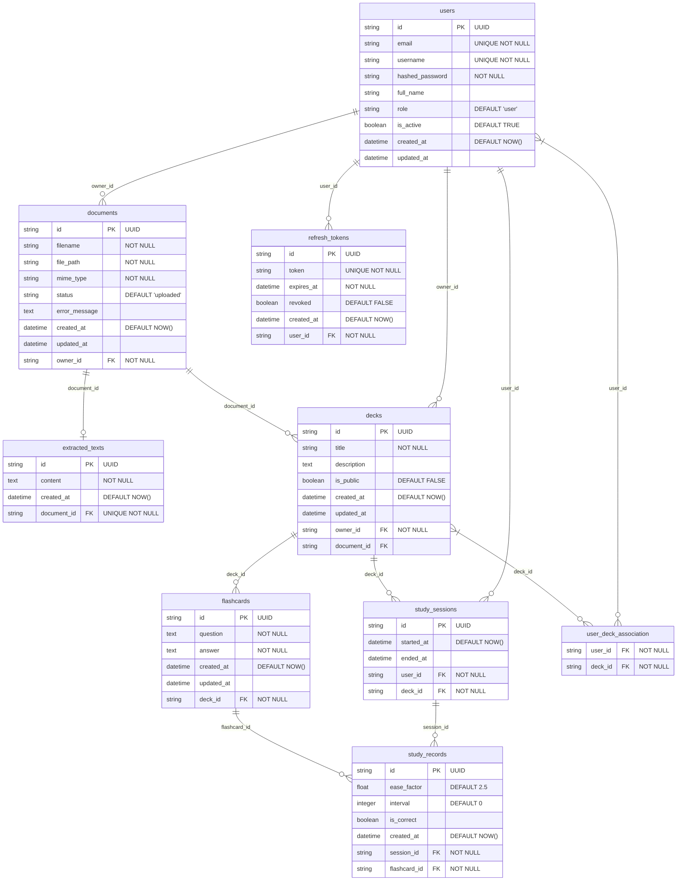

# Physical Data Model (PDM)

## Table Structure

### 1. users
- **id**: string(36), PK, UUID
- **email**: string(255), UNIQUE, NOT NULL, INDEX
- **username**: string(50), UNIQUE, NOT NULL, INDEX
- **hashed_password**: string(255), NOT NULL
- **full_name**: string(100)
- **role**: string(20), DEFAULT 'user'
- **is_active**: boolean, DEFAULT TRUE
- **created_at**: datetime, DEFAULT NOW()
- **updated_at**: datetime

### 2. documents
- **id**: string(36), PK, UUID
- **filename**: string(255), NOT NULL
- **file_path**: string(512), NOT NULL
- **mime_type**: string(100), NOT NULL
- **status**: string(50), DEFAULT 'uploaded'
- **error_message**: text
- **created_at**: datetime, DEFAULT NOW()
- **updated_at**: datetime
- **owner_id**: string(36), FK -> users.id, NOT NULL

### 3. extracted_texts
- **id**: string(36), PK, UUID
- **content**: text, NOT NULL
- **created_at**: datetime, DEFAULT NOW()
- **document_id**: string(36), FK -> documents.id, UNIQUE, NOT NULL

### 4. decks
- **id**: string(36), PK, UUID
- **title**: string(255), NOT NULL
- **description**: text
- **is_public**: boolean, DEFAULT FALSE
- **created_at**: datetime, DEFAULT NOW()
- **updated_at**: datetime
- **owner_id**: string(36), FK -> users.id, NOT NULL
- **document_id**: string(36), FK -> documents.id

### 5. flashcards
- **id**: string(36), PK, UUID
- **question**: text, NOT NULL
- **answer**: text, NOT NULL
- **created_at**: datetime, DEFAULT NOW()
- **updated_at**: datetime
- **deck_id**: string(36), FK -> decks.id, NOT NULL

### 6. study_sessions
- **id**: string(36), PK, UUID
- **started_at**: datetime, DEFAULT NOW()
- **ended_at**: datetime
- **user_id**: string(36), FK -> users.id, NOT NULL
- **deck_id**: string(36), FK -> decks.id, NOT NULL

### 7. study_records
- **id**: string(36), PK, UUID
- **ease_factor**: float, DEFAULT 2.5
- **interval**: integer, DEFAULT 0
- **is_correct**: boolean
- **created_at**: datetime, DEFAULT NOW()
- **session_id**: string(36), FK -> study_sessions.id, NOT NULL
- **flashcard_id**: string(36), FK -> flashcards.id, NOT NULL

### 8. refresh_tokens
- **id**: string(36), PK, UUID
- **token**: string(255), UNIQUE, NOT NULL, INDEX
- **expires_at**: datetime, NOT NULL
- **revoked**: boolean, DEFAULT FALSE
- **created_at**: datetime, DEFAULT NOW()
- **user_id**: string(36), FK -> users.id, NOT NULL

### 9. user_deck_association
- **user_id**: string(36), FK -> users.id, NOT NULL
- **deck_id**: string(36), FK -> decks.id, NOT NULL
- PRIMARY KEY (user_id, deck_id)

## Constraints

1. Primary keys (PK) on all tables
2. Foreign keys (FK) to maintain referential integrity
3. UNIQUE constraints on email, username, token
4. UNIQUE constraint on document_id in extracted_texts (a document has only one extracted text)
5. NOT NULL constraints on required fields
6. Default values for fields like is_active, status, is_public, etc.
