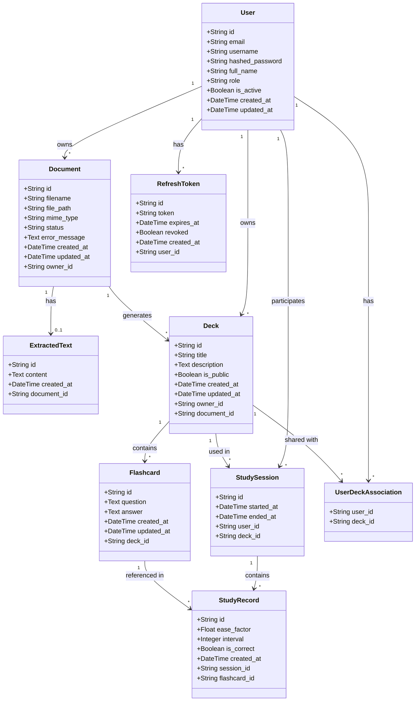

# Database Schema

## Overview

The database schema for the Flashcards project is designed to manage:
- Users and authentication
- Uploaded documents and extracted text
- Flashcard decks and individual cards
- Study sessions and performance tracking

## Database Diagram

## Data Flow

1. **Document Upload and Processing**:
   - A user uploads a document
   - The document is processed by the OCR service to extract text
   - The extracted text is used by the LLM service to generate flashcards
   - A deck is created with the generated flashcards

2. **Study and Review**:
   - A user selects a deck to study
   - A study session is created
   - For each flashcard reviewed, a study record is created
   - Performance metrics are used to adjust the spaced repetition algorithm

3. **Deck Sharing**:
   - A user can share their decks with other users
   - Shared decks are accessible via the user_deck_association table

## Key Features

1. **UUID Identification**: All entities use UUIDs as primary keys for better security and flexibility.

2. **Timestamps**: Most tables include created_at and updated_at fields for tracking changes.

3. **Document Statuses**: Documents go through different processing states (uploaded, ocr_processing, ocr_complete, flashcard_generating, flashcard_complete, error).

4. **Spaced Repetition Algorithm**: The ease_factor and interval fields in StudyRecord are used to implement the SM-2 spaced repetition algorithm.

5. **Secure Authentication**: Use of access and refresh tokens for authentication.

6. **Flexible Relationships**: A document can generate multiple decks, and a deck can exist independently of a document (document_id is nullable in Deck).

## Performance Considerations

1. **Indexing**: Frequently searched fields like email, username, and token are indexed.

2. **Uniqueness Constraints**: UNIQUE constraints are applied to email, username, token, and document_id in extracted_texts.

3. **Referential Integrity**: Foreign keys are used to maintain data integrity between tables.
