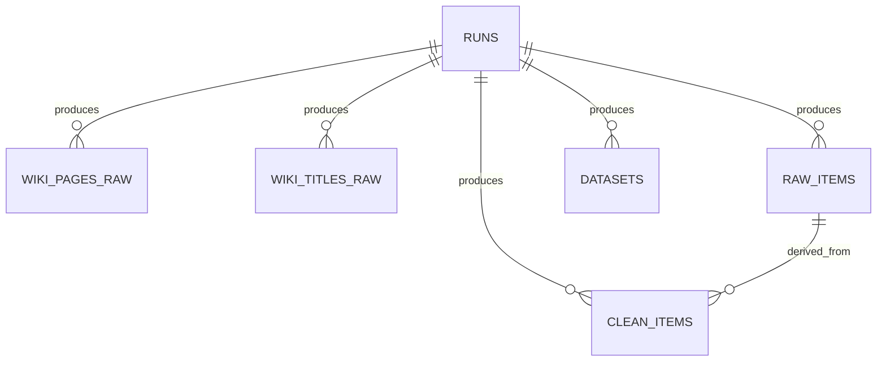

## Merise (C4) — Modélisation des données (E1)

Objectif : **justifier la création des bases** et la structure des données, en restant **isolé dans `e1/`**.

### Périmètre

Deux bases SQLite (séparation *staging* / *final dataset*) :

- **Staging** : `e1/data/wikipedia_external.db`
  - collecte brute (Wikipedia API + dump Wikimedia) + traçabilité
- **Final** : `e1/data/flashcards2.db`
  - dataset multi-sources unifié (`raw_items`), nettoyage (`clean_items`), exports (`datasets`)

### Choix SGBD (SQLite)

- Suffisant pour un pipeline E1 local, reproductible, sans infra.
- Portable (1 fichier), simple pour démontrer : schéma, contraintes, index, requêtes.

---

## MCD (conceptuel) — Entités & relations

### Entité **RUN**

Représente une exécution d’une étape du pipeline (traçabilité).

Attributs : `run_id`, `source`, `started_at`, `ended_at`, `status`, `params_json`, `error_count`.

### Entités “données”

#### Staging Wikipedia

- **WIKI_PAGE_RAW** (pages extraites via Wikipedia API)
  - dépend de RUN (1 RUN → N pages)
- **WIKI_TITLE_RAW** (titres issus du dump)
  - dépend de RUN (1 RUN → N titres)

#### Dataset final

- **RAW_ITEM** (un item texte brut multi-source, unifié)
  - dépend de RUN (1 RUN → N items)
- **CLEAN_ITEM** (version nettoyée + score qualité)
  - dépend de RUN (1 RUN → N items)
  - lien optionnel vers RAW_ITEM (`raw_item_id`)
- **DATASET_EXPORT** (exports CSV/JSONL)
  - dépend de RUN (1 RUN → N exports)

---

## MLD (logique) — Schéma relationnel (résumé)

### `wikipedia_external.db`

- `runs(run_id PK UNIQUE, source, started_at, ended_at, status, params_json, error_count)`
- `wiki_pages_raw(id PK, run_id FK(logique), title, page_id, url, content_raw, fetched_at, content_hash UNIQUE)`
- `wiki_titles_raw(id PK, run_id FK(logique), title, title_length, dump_version, fetched_at, content_hash UNIQUE)`

### `flashcards2.db`

- `runs(run_id PK UNIQUE, source, started_at, ended_at, status, params_json, error_count)`
- `raw_items(id PK, run_id, source, external_id, raw_text, raw_meta_json, fetched_at, content_hash UNIQUE)`
- `clean_items(id PK, run_id, raw_item_id FK -> raw_items.id (NULLABLE), clean_text, language, quality_score, clean_meta_json, created_at, content_hash UNIQUE)`
- `datasets(id PK, run_id, export_path, format, rows_count, schema_json, created_at)`

Contraintes importantes :

- `content_hash UNIQUE` permet la **déduplication** (re-run idempotent).
- Index sur `*_run_id` pour faciliter l’audit par run.

---

## MPD (physique) — Implémentation SQLite

Le MPD est implémenté en SQL brut dans : `e1/src/e1_pipeline/db_init.py`.

### Mini diagramme (optionnel) en Mermaid

> À coller tel quel dans un éditeur Mermaid si besoin.

