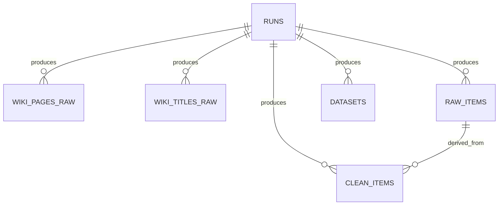

# Data Model — E1 Pipeline

The pipeline uses two SQLite databases to separate concerns between raw data staging
and the final curated dataset.

## Databases

| Database | Path | Role |
|---|---|---|
| Staging | `e1/data/wikipedia_external.db` | Raw collection from Wikipedia API and Wikimedia dumps, with run traceability |
| Final dataset | `e1/data/flashcards2.db` | Unified multi-source items, cleaned items, and export records |

**Why SQLite?** The pipeline runs locally with no external infrastructure. A single
portable file per database is sufficient to demonstrate schema design, constraints,
indexes, and queries while keeping the setup reproducible.

---

## Conceptual model (MCD) — Entities and relationships

### Entity **RUN**

Represents a single execution of a pipeline step (full traceability).

Attributes: `run_id`, `source`, `started_at`, `ended_at`, `status`, `params_json`, `error_count`.

### Data entities

#### Staging database (`wikipedia_external.db`)

- **WIKI_PAGE_RAW** — pages fetched via the Wikipedia API; each page belongs to one RUN (1 to N).
- **WIKI_TITLE_RAW** — titles extracted from the Wikimedia dump; each title belongs to one RUN (1 to N).

#### Final dataset (`flashcards2.db`)

- **RAW_ITEM** — unified raw text item from any source; belongs to one RUN (1 to N).
- **CLEAN_ITEM** — normalised, deduplicated, quality-scored version of a raw item; optional link back to `RAW_ITEM`.
- **DATASET_EXPORT** — metadata record for each CSV/JSONL export; belongs to one RUN (1 to N).

---

## Logical model (MLD) — Relational schema summary

### `wikipedia_external.db`

- `runs(run_id PK UNIQUE, source, started_at, ended_at, status, params_json, error_count)`
- `wiki_pages_raw(id PK, run_id FK, title, page_id, url, content_raw, fetched_at, content_hash UNIQUE)`
- `wiki_titles_raw(id PK, run_id FK, title, title_length, dump_version, fetched_at, content_hash UNIQUE)`

### `flashcards2.db`

- `runs(run_id PK UNIQUE, source, started_at, ended_at, status, params_json, error_count)`
- `raw_items(id PK, run_id, source, external_id, raw_text, raw_meta_json, fetched_at, content_hash UNIQUE)`
- `clean_items(id PK, run_id, raw_item_id FK -> raw_items.id (NULLABLE), clean_text, language, quality_score, clean_meta_json, created_at, content_hash UNIQUE)`
- `datasets(id PK, run_id, export_path, format, rows_count, schema_json, created_at)`

Key constraints:

- `content_hash UNIQUE` ensures **deduplication** — re-running a pipeline step is idempotent.
- Indexes on `*_run_id` columns support fast per-run auditing.

---

## Physical model (MPD) — SQLite implementation

The physical schema is implemented in plain SQL in `e1/src/e1_pipeline/db_init.py`.

### Entity-relationship diagram (Mermaid)

